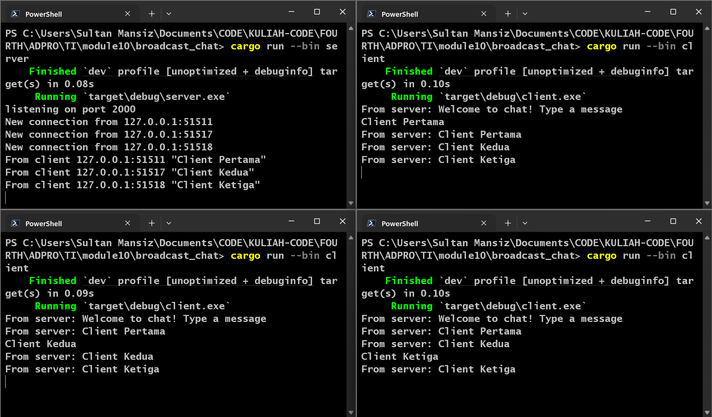

| NAME               | ID         | ADVPROG CLASS |
| ------------------ | ---------- | ------------- |
| Sultan Ibnu Mansiz | 2306275840 | B             |

# Module 10: Asynchronous Programming - Broadcast Chat

## Original Code

Clients and the server communicate via WebSocket, enabling real-time interaction. When a client sends a message, the server relays it to all connected clients, creating a broadcast effect where the message from one client is received by every other connected client. This mechanism facilitates efficient and simultaneous data distribution across multiple participants.